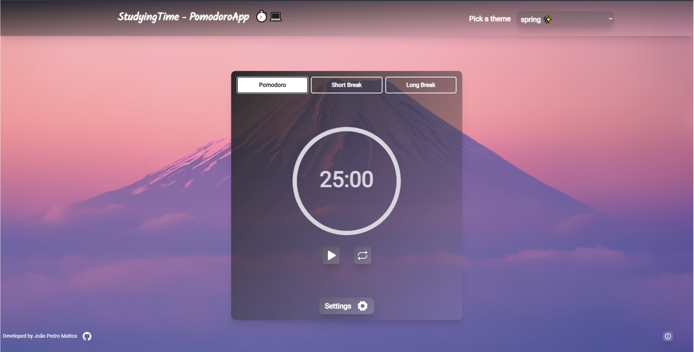

<h1 align="center"> Pomodoro App </h1>

Project developed for my portfolio. However, it was built with the intention of impacting some student friends, explaining how the method works and bringing a nice interface. I hope it helps in some way!

 

  

 

## 🚀 Technologies

- React 
- Typescript
- Tailwind
- [Node e NPM](https://nodejs.org/)
- [Vite](https://vitejs.dev/)

 

## 💻 Project

 <h3>What is the pomodoro technique?</h3>
    
A time management method that encourages focus in an intense and integral way.

 <h3>Why use the pomodoro method?</h3>
    
With this strategy, what is being done is seen more clearly by the person, making them feel more productive. In addition, each break is designed not to overwhelm your mind. Making your task more productive.

 <h3>How it works?</h3>
    
 - Pick a tesk ✏️
 
    
 - Set a 25 minutes timer ⌛
  
    
 - Work on it until time is up 👨‍💻
  
    
 - Take a 5 minute break ☕
  
    
 - Every 4 pomodoros, take a long break (10/15 min) 🌳
    

 

## 🔖 Website
If you are interested, check out the project by clicking on the link below

- [Pomodoro App](https://pomodoro-app-liart.vercel.app/)

